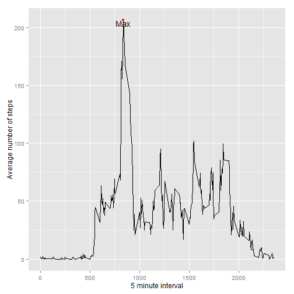
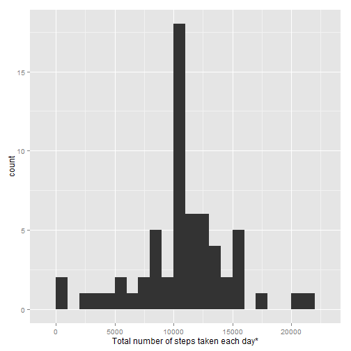
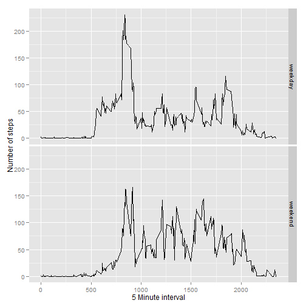

## Loading and preprocessing the data


```r
activity_data <- read.csv("activity.csv")
```


## What is mean total number of steps taken per day?

Here is the mean  total of steps taken per day:


```r
#Get total steps summed by date
total_steps <- tapply(activity_data$steps, activity_data$date, FUN=sum, na.rm=TRUE)

#Plot out the histogram
library(ggplot2)
qplot(total_steps, binwidth=1000, xlab="Total number of steps taken each day")
```

 

```r
mean(total_steps, na.rm=TRUE)
```

```
## [1] 9354.23
```

```r
median(total_steps, na.rm=TRUE)
```

```
## [1] 10395
```

## What is the average daily activity pattern?

##Time series plot of the average daily activity by 5 minute intervals

#Average the steps

The average daily number of steps by 5 minute intervals


```r
average_steps <- aggregate(x=list(steps=activity_data$steps), 
                           by=list(interval=activity_data$interval),
                           FUN=mean, na.rm=TRUE)

#Max average
max_average <- average_steps[which.max(average_steps$steps),]

#Plot the averages with the maximum average displayed as a red point						   
ggplot(data=average_steps, aes(x=interval, y=steps)) +
       geom_line() +
	   xlab("5 minute interval") +
       ylab("Average number of steps") +
	   geom_point(data = max_average, color = 'red') +
	   geom_text(data= max_average, label="Max", vjust=1) 
```

 

The maximum average is

```r
max_average
```

```
##     interval    steps
## 104      835 206.1698
```

## Imputing missing values

Histogram with missing steps filled with the mean value of the 5 minute intervals


```r
##Find the missing values

missing_steps <- is.na(activity_data$steps)
table(missing_steps)
```

```
## missing_steps
## FALSE  TRUE 
## 15264  2304
```

```r
#Function to fill in the missing steps with the mean value of the 5 minute intervals
fill_value <- function(steps, interval) {
    filled <- NA
    if (!is.na(steps))
        filled <- c(steps)
    else
        filled <- (average_steps[average_steps$interval==interval, "steps"])
    return(filled)
}
filled_steps <- activity_data
filled_steps$steps <- mapply(fill_value, filled_steps$steps, filled_steps$interval)

#Histogram of the modified activity data using the mean value for NA
total_steps <- tapply(filled_steps$steps, filled_steps$date, FUN=sum)
qplot(total_steps, binwidth=1000, xlab="Total number of steps taken each day*")
```

 

```r
mean(total_steps)
```

```
## [1] 10766.19
```

```r
median(total_steps)
```

```
## [1] 10766.19
```


## Are there differences in activity patterns between weekdays and weekends?

Plot of the differences between weekday and weekend activity


```r
#Function to determine if weekday or weekend
weekday_weekend <- function(date) {
    day <- weekdays(date)
    if (day %in% c("Monday", "Tuesday", "Wednesday", "Thursday", "Friday"))
        return("weekday")
    else if (day %in% c("Saturday", "Sunday"))
        return("weekend")
    else
        stop("invalid date")
}
filled_steps$date <- as.Date(filled_steps$date)
filled_steps$day <- sapply(filled_steps$date, FUN=weekday_weekend)


##Differences between weekday and weekend activity
averages <- aggregate(steps ~ interval + day, data=filled_steps, mean)
ggplot(averages, aes(interval, steps)) + geom_line() + facet_grid(day ~ .) +
    xlab("5 Minute interval") + ylab("Number of steps")
```

 
